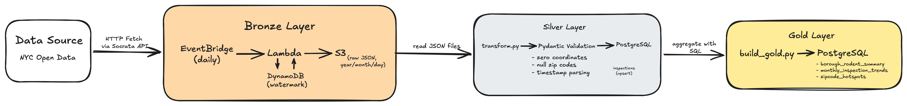

# NYC Rodent Inspection Pipeline

An end-to-end data pipeline built on AWS using the Medallion Architecture pattern. The pipeline ingests NYC Rodent Inspection data daily from NYC Open Data, transforms and validates it through bronze, silver, and gold layers, and produces aggregated analytical tables for borough-level and zipcode-level rodent activity analysis. Built to demonstrate real-world data engineering skills including cloud ingestion, data validation, pipeline orchestration, and analytical modeling.

## Architecture



### Bronze Layer
Raw ingestion via AWS Lambda, scheduled daily with AWS EventBridge. Fetches batches of rodent inspection records from NYC Open Data Socrata API using a watermark pattern backed by AWS DynamoDB to track the latest ingested record. Raw JSON files stored in AWS S3 partitioned by year/month/day.

### Silver Layer
Python transformation script using Pydantic V2 for validation and cleaning. Handles missing coordinates, null zip codes, and timestamp parsing. Loads cleaned record into PostgreSQL using an upsert pattern with change detection based on the source `updated_at` field.

### Gold Layer
Three aggregated analytical tables built from the silver layer using raw SQL and psycopg2. Refreshed on demand via `gold/build_gold.py`.

## Tech Stack
- Python, AWS Lambda, AWS S3, AWS DynamoDB, AWS EventBridge, Pydantic, psycopg2-binary, postgreSQL

## Pipeline Flow

1. AWS EventBridge triggers the Lambda function daily.
2. Lambda fetches new records from NYC Open Data Socrata API in batches of 1000.
3. DynamoDB watermark tracks the latest ingested record ID and timestamp.
4. Raw JSON batches are stored in S3 under `raw/year=/month=/day=`.
5. `silver/transform.py` reads JSON files, validates with Pydantic, and upserts into PostgreSQL `inspections` table.
6. `gold/build_gold.py` aggregates silver data into three gold tables.

## How To Run Locally

### Prerequisites
- Docker
- Python 3.11+
- PostgreSQL running via Docker

### 1. Clone the repo
git clone https://github.com/Mercovsk/nyc-rodent-pipeline.git
cd nyc-rodent-pipeline

### 2. Start PostgreSQL
cd docker
docker-compose up -d

### 3. Configure environment
cp .env.example .env
# Edit .env with your database credentials

### 4. Install dependencies
pip install -r requirements.txt

### 5. Run migrations
chmod +x scripts/migrate.sh
./scripts/migrate.sh

### 6. Download a sample JSON file from S3
Place one or more `.json` files into the `data/` folder at the project root.

### 7. Run the silver layer
python silver/transform.py

### 8. Run the gold layer
python gold/build_gold.py

## Orchestration

The pipeline is orchestrated using Apache Airflow running locally via Docker.

### DAG: `nyc_rodent_pipeline`
- **Schedule:** Daily (`0 0 * * *`)
- **Task:**
   1. `run_silver_layer` - validates and loads JSON file from `data/raw/` into PostgreSQL
   2. `run_gold_layer` - aggregates silver data into three gold tables
- **Dependencies:** Gold layer only runs after silver layer succeeds

### Setup Airflow (First Time Only)
```bash
mkdir -p ./dags ./logs ./plugins ./config
echo "AIRFLOW_UID=$(id -u)" >> .env
docker-compose -f airflow-docker-compose.yaml up airflow-init
```

### Start Airflow
```bash
docker-compose -f airflow-docker-compose.yaml up -d
```

UI available at `http://localhost:8080`
Default credentials: `airflow` / `airflow`

### Notes
- Airflow uses a separate PostgreSQL instance on port 5433 for metadata
- Project files are mounted at `/opt/airflow/pipeline` inside the container
- Place new JSON files in `/data` before triggering a manual run

## Data Transformation (dbt)

The gold layer is also implemented using dbt for automated transformation, testing, and documentation.

### Models
|
Models
|
Description
|
|
---
|
---
|
|
`borough_rodent_summary`
|
Borough-level aggregation inspection results
|
|
`monthly_inspection_trends`
|
Monthly inpsection counts and rates per borough
|
|
`zipcode_hotspots`
|
Zip code level infestation scoring
|

### Setup
Install dbt dependencies:
\``` bash
pip install dbt-core==1.8.0 dbt-postgres==1.8.0
\```

Create `dbt/profile.yml` from the example
\```bash
cp dbt/profiles.yml.example dbt/profiles.yml
# Edit with your database credentials
\```

### Run dbt
\```bash
cd dbt

# Build gold layer tables
dbt run

# Run data quality tests
dbt test

# Generate and serve documentation
dbt docs generate
dbt docs serve
\```

### Tests
33 automated data quality tests covering:
- `not_null` constraints on all key columns
- `unique` constraints on borough in borough_rodent_summary
- `accepted_values` for borough in zipcode_hotspots

## Data Source

NYC Open Data — Rodent Inspection Dataset
https://data.cityofnewyork.us/Health/Rodent-Inspection/p937-wjvj/about_data

## Project Status

| Layer | Status | Notes |
| ----- | ------ | ----- |
| Bronze | ✅ Active | Ingesting daily since February 23, 2026 |
| Silver | ✅ Active | 10,000+ records validated and loaded |
| Gold | ✅ Complete | 3 analytical tables built |
| Architecture Diagram | ✅ Complete |  |
| Airflow Orchestration | ✅ Complete | |
| dbt Gold Layer | ✅ Complete | 3 models, 33 tests passing |